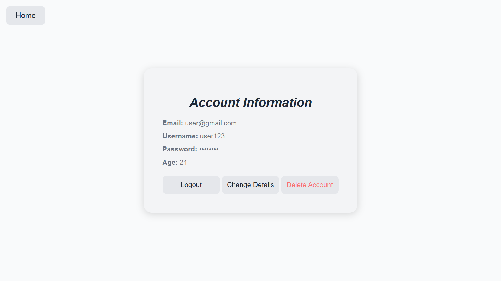
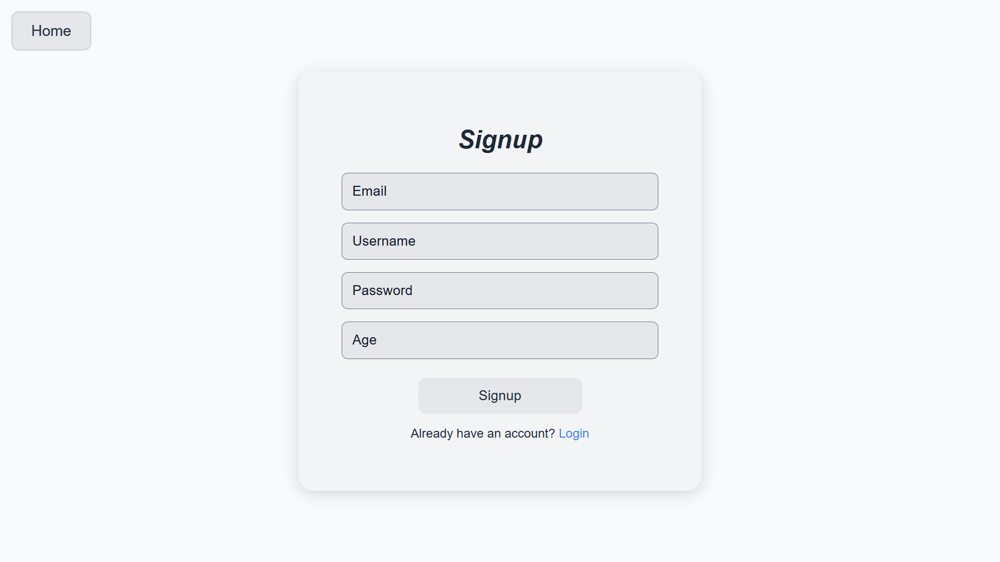
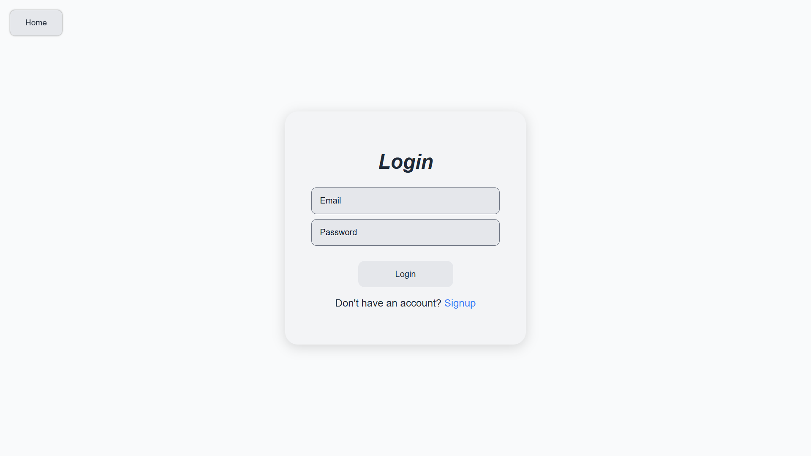
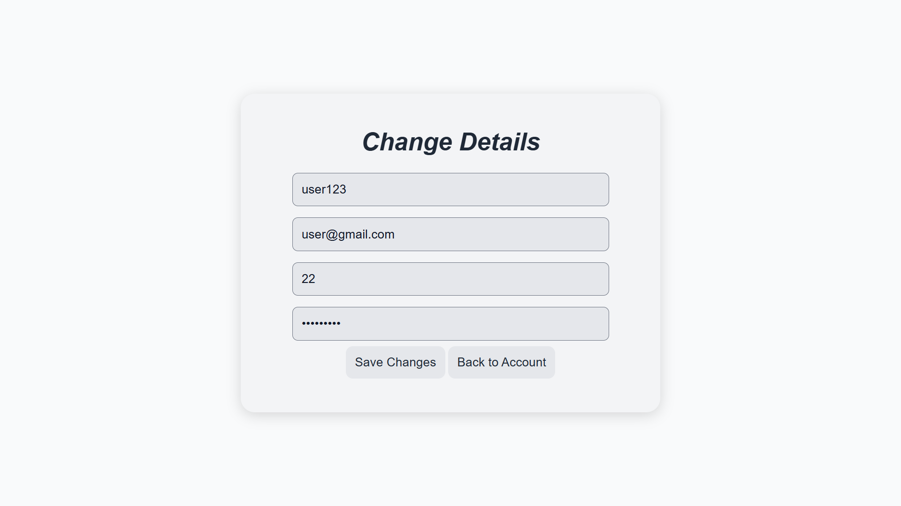

# Developer News Dashboard


A **responsive, Vanilla JavaScript-powered dashboard** that aggregates **tech news from multiple sources** into one clean, minimal interface.  
Built to **practice core JavaScript skills** before learning React and to create a tool I personally use to stay updated on developer news.

## Demo

  





[🔗 **Live Demo on Vercel**](https://your-vercel-link.vercel.app)

## Features

- **Search** – Quickly filter through news cards by title or content  
- **Account management** – Sign up, log in, and manage account details  
- **Favorite Articles** – Mark and store favorite news cards for easy access 
- **Responsive Design** – Optimized for mobile, tablet, and desktop  
- **Multiple Sources** – Aggregates news from multiple favorite websites  
- **Fast & Lightweight** – Vanilla JavaScript front-end, minimal backend

## Motivation

I built this project because:
1. I wanted **one simple dashboard** to access all the tech news I read daily.  
2. I wanted to **strengthen my JavaScript skills** before diving into React.

This project is **free for anyone** to use and is especially useful for developers, tech enthusiasts, and learners who want to keep up with tech updates.

## Tech Stack

- **Vanilla JavaScript (ES6+)** – DOM manipulation, events, async APIs  
- **HTML5 & CSS3** – Semantic layout, responsive grid/flexbox  
- **Express.js (Minimal)** – Backend to serve Reddit API content  
- **REST APIs** – Fetch news content dynamically  
- **Vercel** – Deployment & hosting

## Getting Started

## 1. Clone the repo
```bash
git clone https://github.com/your-username/Developer-News-Dashboard.git
cd Developer-News-Dashboard
```
## 2. Start the backend
```bash
cd backend
node server.js
```
## Launch the frontend
- Open **frontend/html/index.html** with Live Server in VS Code.
- The app will run locally and fetch data from the backend.

### What I Learned

- How to **build JavaScript projects at moderate scale**
- How to **leverage browser developer tools** effectively
- **Git/GitHub best practices** for version control and collaboration

### Challenges Faced

- Making the dashboard **fully responsive** for multiple devices (phones, tablets, laptops, desktops)
- Implementing **user features (accounts, favorites)** without a full database to keep the project (almost) completely Vanilla JS

### Performance

Evaluated by the following tools: ESLint, SonarLint, Lighthouse and NPM's vulnerability checker (```npm audit fix```)

## Lighthouse Evaluations


### Feedback Welcome

I'd love to hear your thoughts, critiques, and suggestions for improvement! Connect with me on LinkedIn  to share your ideas.
